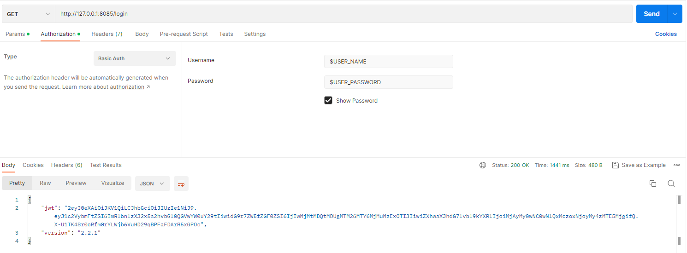
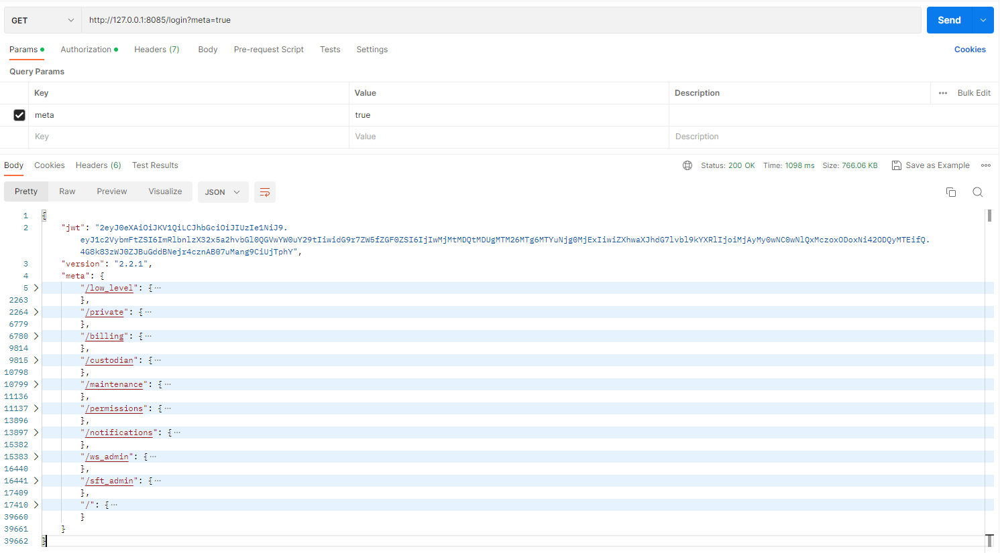
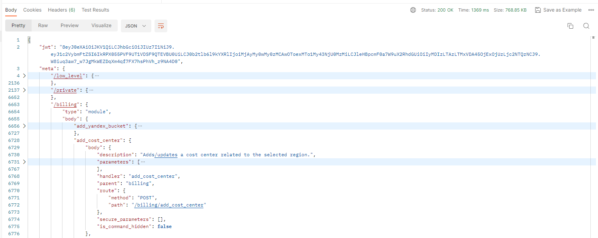
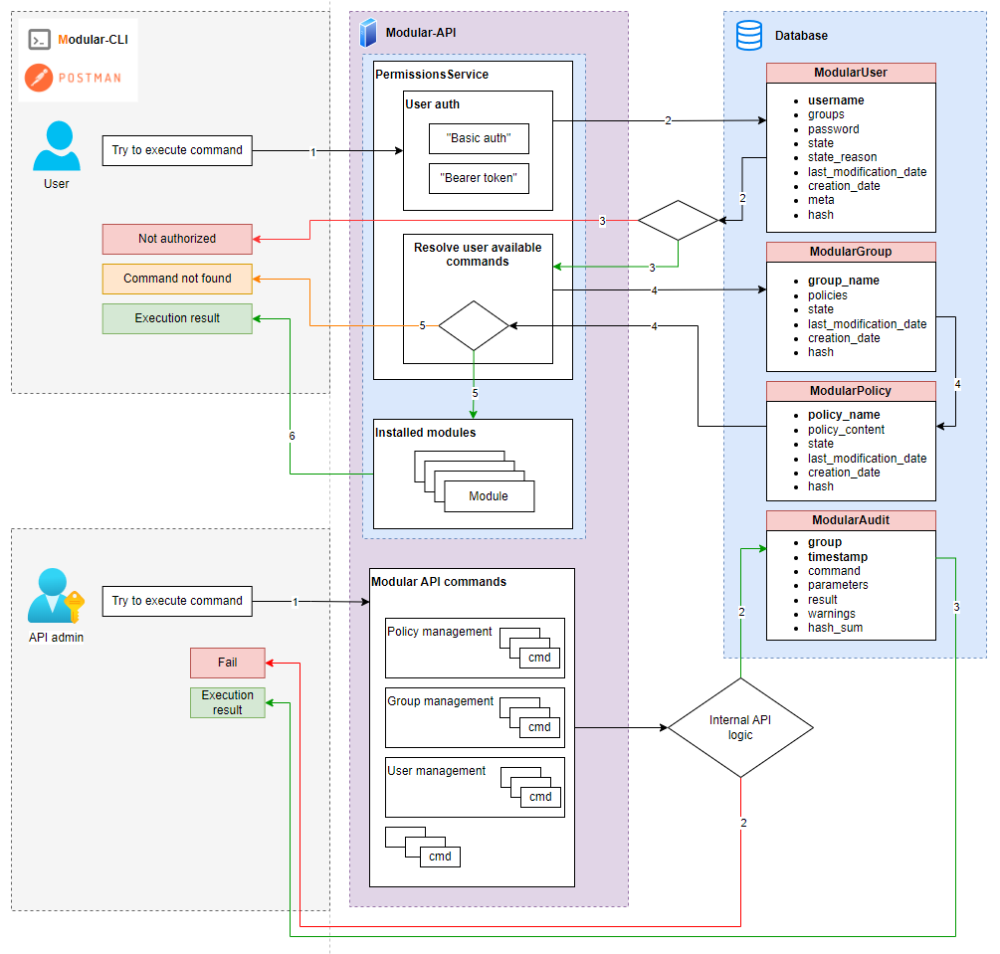

# Modular API

<a name="content"></a>
## Content  

1. [General information](#general_information)
2. [Installation and configuration](#installation_and_configuration)
3. [Policies management](#policies_management)
4. [Group management](#group_management)
5. [User management](#user_management)
6. [Audit service](#audit_service)
7. [Modules installation](#modules_installation)
8. [First run](#first_run)
9. [Modular API schema](#modular_api_schema)
10. [Project information](#project_information)

<a name="general_information"></a> 
## 1. General information
Modular API is a facade which allows to combine different services controls under one 
custom API/CLI service. A service is actually module. It includes a Compute part (
Lambda, EC2, EKS, AWS butch), it has an API(any), and this API has a CLI client. 
For interaction with Modular API you can use 
[Modular CLI](https://git.epam.com/epmc-eoos/m3-modular-cli/-/blob/develop/README.md) 
or any other suitable for you API-client like [Postman](https://www.postman.com/), 
[Insomnia](https://insomnia.rest/), etc.
Typically, a service uses the following elements:
* **API**: API Gateway, Lambda Function URL, Container exposed, AMQP
* **Authentication**: Custom JWT / Cognito
* **Authorization**: ABAC
* **CLI**: Thin client, descriptor for Modular-API
* **Compute**: Lambda, AWS Batch, EKS
* **Runtimes**: Python 3.8+, Java 11, NodeJS 18.16.0
* **Persistence**: AWS DynamoDB, MongoDB Atlas, AWS DocumentDB, AWS RDS, S3

The Modular-API includes interface descriptors(CLI Clients). A descriptor is a file 
which specifies an entry point to the module. The Click Python library is used to 
describe the interface. This information is parsed into a specific structure in the 
Modular-API facade.  
After that, the Modular-API puts its own features set atop of the API/module/response:
* Provides its own unified authentication mechanism.
* Provides its own unified ABAC. This allows to have multiple services managed 
  in a unified way from a single entry point and with the same permissions settings
* Provides pre-validation of requests before the request is sent to the Module backend
* Provides centralized audit, logging and manages the temporary tokens retrieved 
  during the client authentication on module`s backend
* Has its own database and CLI that is not available from outside.


[Content ↑](#content)

<a name="installation_and_configuration"></a> 
## 2. Installation and Configuration
#### Installation

The installation of Modular-API assumed that you have Python3.9 and pip installed.
Use the following links to install the tools in case they are not installed.</br>

[Python download page](https://www.python.org/downloads/)

[Pip installation page](https://pip.pypa.io/en/stable/installation/)

<span style="color:red">**NOTE**</span>: 
Due to the best Python practices, it is highly recommended to use virtual 
environment to protect project against dependency breakage.

[Creating Virtual Environments Guide](https://packaging.python.org/en/latest/tutorials/installing-packages/#creating-and-using-virtual-environments)

* Create: `python -m venv modular_api_venv`  
* Activate (Linux): `source modular_api_venv/bin/activate`   
  Activate (Windows): `source modular_api_venv/Scripts/activate`   
* Installation: `pip install setup.py`  

#### Configuration

The API wrapper requires some configurations. Configuration file is `modular_api\startup_config.json`  
The content template is placed below:

```json5
{
  "swagger-ui": {
    "path": '$string',
    "enable": '$boolean'
  },
  "host": '$string',
  "port": '$integer',
  "secret_passphrase": '$string',
  "mode": '$string',
  "url_prefix": '$string',
  "minimal_allowed_cli_version": '$string'
}
```
* **Key**: **Value**
  * **"swagger-ui"**
    * **"path"**: path where Swagger is available, for example: "/swagger"
    * **"enable"**: "true/false", if "true" allows to run Swagger
  * **"host"**: host to run the server, for example - "127.0.0.1"
  * **"port"**: port to run the server, for example - 8085
  * **"secret_passphrase"**: secret passphrase used to secure JWT, password. Also used in 
     policy, group, user items for  hash sum calculation
  * **"mode"**: mode in which the tool will be run. Allowed values: "saas", "onprem" or "private". 
    If "onprem/private" mode enabled - local file-like database will be used. If "saas" mode enabled - 
    AWS DynamoDB will be used 
  * **"url_prefix"**: modifying the URL pointing to Swagger-API definition - $url_prefix/$path. Can be an empty string
  * **"minimal_allowed_cli_version"**: check Modular-CLI version, for example - "1.1". If Modular-CLI version 
    lower than specified in property - warning message will be shown to the user  

#### Loggers configuration

There is an option to customize log files paths for Modular API and 
Modular API CLI using optional environment variables that are described below:

* `SERVICE_LOGS` - custom full path of the Modular API logs
* `MODULAR_API_CLI_LOGS` - custom full path of the Modular API CLI logs


[Content ↑](#content)

<a name="policies_management"></a> 
## 3. Policies management

Available commands:
* Add new policy  
  `modular policy add --policy $POLICY_NAME --policy_path $PATH_TO_POLICY_FILE.JSON`
* Update existing policy  
  `modular policy update --policy $POLICY_NAME --policy_path $PATH_TO_POLICY_FILE.JSON`
* Delete existing policy  
  `modular policy delete --policy $POLICY_NAME`
* Describe all policies  
  `modular policy describe`
  * if flag `--expand` specified, then full description for all policies will be 
    shown. Has no effect and always 'True' if '--policy' parameter passed
  * if parameter `--policy` specified, then full policy content will be shown

#### Policy template
```json5
[
  {
    "Effect": <string>'...',
    "Module": <string>'...',
    "Resources": <list> [
      <string>'statement_1',
      <string>'statement_2',
      '...',
      <string>'statement_N'
    ]
  }
]
```
#### Policy rules
* **Deny** effect has more priority than **Allow**.
* If some command/groups/subgroups/modules are not in user policy(ies) then 
they will not be available to use
#### Property "Effect"
* Required. Possible values: "Allow" or "Deny"
#### Property "Module" syntax
* Required.
* For m3admin root(src) module use "m3admin" name instead of "/"
* You can use `*` symbol in "Module" property. This will mean that "Effect" 
is being applied for all current modules installed in Modular-API
* Module name is equal to property "mount_point" in "api_module.json" file in each 
Modular-API module, but use it without first symbol `/`
#### Property "Resources", syntax for statements 
* Required and property can not be empty
* **"*"** -> apply "Effect" for entire module
* **"$command"** -> apply "Effect" for a single command in module
* **"$group:*"** -> apply "Effect" for group and it`s commands/subgroups
* **"$group:$command"** -> apply "Effect" for a single command in group
* **"$group/$subgroup:*"** -> apply "Effect" for subgroup and it`s commands
* **"$group/$subgroup:command"** -> apply "Effect" for a single command in subgroup

[Content ↑](#content)

<a name="group_management"></a> 
## 4. Group management

Available commands:
* Add new group with policy  
  `modular group add --group $GROUP_NAME --policy $POLICY_NAME`  
  Assuming that policy already created
* Add new policy to existing group  
  `modular group add_policy --group $GROUP_NAME --policy $POLICY_NAME`  
  Assuming that policy and group already exist
* Delete policy from group  
  `modular group delete_policy --group $GROUP_NAME --policy $POLICY_NAME`  
* Describe group and attached policy(ies)  
  `modular group describe --group $GROUP_NAME`
* Delete group  
  `modular group delete --group $GROUP_NAME`

[Content ↑](#content)

<a name="user_management"></a> 
## 5. User management

Available commands:
* Add new user  
  Assuming that group already created  
  `modular user add --username $USER_NAME --group $GROUP_NAME`   
  * if `--password` passed, then your custom password will be saved for user item.   
  If `--password` parameter not specified then autogenerated password will be provided.  
  <span style="color:red">Please NOTE</span>: there is no mechanism to retrieve it again if it lost, just reset and 
  set a new password.
* Delete existing user:   
  `modular user delete --username $USER_NAME`
* Block existing user access without deletion   
  `modular user block --username $USER_NAME --reason $INFO_WHY_USER_IN_BLACK_LIST`    
* Restore blocked user access   
  `modular user unblock --username $USER_NAME --reason $INFO_WHY_USER_BACK_TO_WHITE_LIST`  
* Restore lost password for user   
  `modular user change_password --username $USER_NAME --password $NEW_PASSWORD`
* Attach group(s) to user  
  `modular user add_to_group --username $USER_NAME --group $GROUP_1 --group $GROUP_2 ... --group $GROUP_N`
* Remove group(s) from user  
  `modular user remove_from_group --username $USER_NAME --group $GROUP_1 --group $GROUP_2 ... --group $GROUP_N`
* Describe users information  
  `modular user describe`
  * if `--username` parameter passed, then particular user will be described

Commands to restrict some parameters values in allowed for user commands:  
* Set parameter name and its value(s)  
  `modular user set_meta_attribute --username $USER_NAME --key $PARAMETER_FULL_NAME --value $VALUE_1 --value $VALUE_2 ... --value $VALUE_N`  
  For example: modular user set_meta_attribute --username user --key key1 --value value1
  So, `user` allowed to execute `$module_name $command_name --key1 value2`, but `$module_name $command_name --key1 value1` command is not allowed  
* Update parameter value(s)  
  `modular user update_meta_attribute --username $USER_NAME --key $PARAMETER_FULL_NAME --value $VALUE_1 --value $VALUE_2 ... --value $VALUE_N`
* Delete parameter name(s)  
  `modular user delete_meta_attribute --username $USER_NAME --key $PARAMETER_FULL_NAME_1 --key $PARAMETER_FULL_NAME_2 ... --key $PARAMETER_FULL_NAME_N`
* Erase all restricted parameters from user  
  `modular user reset_meta --username $USER_NAME`
* Describe restricted parameters for user  
  `modular user get_meta --username $USER_NAME`

[Content ↑](#content)

<a name="audit_service"></a> 
## 6. Audit service

All successful results of modular commands execution will be saved to ModularAudit collection. For 
describing audit content use command:   
`modular audit` - describes all audit records for the last 7 days from the current date. Also, you can 
use some filters to expand time range or filter records by group/commands:  
* `--from_date` : Filter by date from which records are displayed. Format yyyy-mm-dd
* `--to_date` :  Filter by date until which records are displayed. Format yyyy-mm-dd
* `--group` : Filter by group name
* `--command` : Filter by command name
* `--limit` :  Number of records that will be shown. Default value is 10
* `--invalid` : Flag to show only invalid audit events 

<span style="color:orange">Please NOTE</span>: "describe" like commands are not recorded into ModularAudit

[Content ↑](#content)

<a name="modules_installation"></a> 
## 7. Modules installation

To install new module into Modular-API check the next steps:
1) Ensure that component installation directory has file `api_module.json` with the next content:
```json5
{
  "module_name": "$MODULE_NAME",
  "cli_path": "$PATH_TO_CLI_MAIN_GROUP",
  "mount_point": "/$MODULE_NAME" // "/entry point for module"
}

```
2) Ensure that component's `setup.py` file is in the same directory as `api_module.json` file
3) Component files that contain commands have the next naming:
   * `groupname.py` for group with commands
   * `groupname_subgroupname.py` for subgroup commands in group  
   "_" symbol in filename means that first part of name is group name, second one - subgroup name

4) Execute command  
   `modular install --module_path $PATH_TO_SETUP.PY`
Please note: if module to be installed has dependency from other module(s) `api_module.json` file can 
be extended with the optional property "dependencies"":
```json5
{
  "dependencies": [
      {
          "module_name": "$MODULE_NAME_DEPENDENT_FROM",
          "min_version": "$MIN_ALLOWED_VERSION_OF_DEPENDED_MODULE"
      },
      ...            
  ]
}
```
During installation/uninstallation process all mentioned dependencies will be checked automatically

[Content ↑](#content)

<a name="first_run"></a> 
## 8. First run

Check list before start:
1) `startup_config.json` file properly configured  
2) `startup_config.json` modes:
   * if "mode" property is "saas" then AWS DynamoDB will be used as DB. You 
   should set the following environment variables:
      * AWS_ACCESS_KEY_ID
      * AWS_SECRET_ACCESS_KEY
      * AWS_SESSION_TOKEN
      * AWS_REGION  
   * if "mode" property is "onprem" then local file-based DB will be in usage. By 
   default, all IO operations with DB use the next storage path: 
   `~user-home-dir\.modular_api\databases`. You can change this path by setting 
   environment variable, key - `MODULAR_LOCAL_DB_PATH` and value is the path to the 
   custom directory 
3) at least one policy created and attached to the group
4) user created and group with policy attached to the user
5) at least one component installed in Modular-API

Go to directory `modular_api/` and run command `python index.py`

```commandline
Bottle v0.12.19 server starting up (using WSGIRefServer())...
Listening on http://127.0.0.1:8085/
Hit Ctrl-C to quit.
```

Now you can send requests to Modular-API via Modular-CLI or any other API-client like Postman, 
Insomnia, etc.

If you use Modular-CLI, please see [README](https://git.epam.com/epmc-eoos/m3-modular-cli/-/blob/develop/README.md) file.

If you use another API client (for example, Postman):
1) Login and get API meta  
**Path**: Modular-API server http  
**Resource**: "login"  
**Authorization type**: "Basic auth"


For retrieving commands meta pass parameter `meta`, value is `true`



2) Use API meta to find desired command and create new request for command execution  
**Path** : `meta`>`$module_name`>`body`>`$command_name`>`body`>`route`>`path`  
**Method** : `meta`>`$module_name`>`body`>`$command_name`>`body`>`route`>`method`
**Authorization** : "Basic auth" with the username and password or "Bearer Token" with the token 
from `jwt` property in API meta


[Content ↑](#content)

<a name="modular_api_schema"></a> 
## 9. Modular API schema



#### Agenda

**For "User":**
1) Execute command
2) Check user in DB
3) Resolve commands available for user or exit if user not found
4) Get user's group, then get user's policy from group. Check command in policy
5) Try to execute command or exit
6) Execution result

**For "API admin":**
1) Execute command
2) Save execution result to ModularAudit collection if execution successful, else exit 
without saving
3) Return execution result

[Content ↑](#content)

<a name="project_information"></a> 
## 10. Project Information

**Source Code**: https://github.com/epam/modular-api  
**Documentation**: https://github.com/epam/modular-api/blob/main//README.md  
**Changelog**: https://github.com/epam/modular-api/blob/main/CHANGELOG.md  
**Supported Python Version**: 3.9
