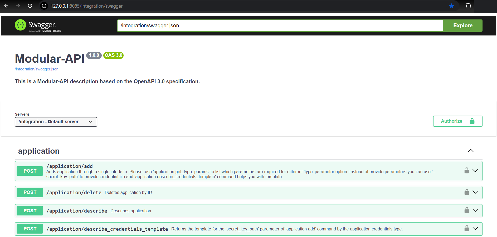

# Modular API

<a name="content"></a>
## Content  

1. [General information](#general_information)
2. [Installation and configuration](#installation_and_configuration)
3. [Policies management](#policies_management)
4. [Group management](#group_management)
5. [User management](#user_management)
6. [Audit service](#audit_service)
7. [Modules installation](#modules_installation)
8. [First run](#first_run)
9. [Modular API schema](#modular_api_schema)
10. [Project information](#project_information)

<a name="general_information"></a> 
## 1. General information
Modular API is a facade which allows to combine different services controls under one 
custom API/CLI service. A service is actually module. It includes a Compute part (
Lambda, EC2, EKS, AWS butch), it has an API(any), and this API has a CLI client. 
For interaction with Modular API you can use 
[Modular CLI](https://git.epam.com/epmc-eoos/m3-modular-cli/-/blob/develop/README.md) 
or any other suitable for you API-client like [Postman](https://www.postman.com/), 
[Insomnia](https://insomnia.rest/), etc.
Typically, a service uses the following elements:
* **API**: API Gateway, Lambda Function URL, Container exposed, AMQP
* **Authentication**: Custom JWT / Cognito
* **Authorization**: ABAC
* **CLI**: Thin client, descriptor for Modular-API
* **Compute**: Lambda, AWS Batch, EKS
* **Runtimes**: Python 3.10, Java 17, NodeJS 18.16.0
* **Persistence**: AWS DynamoDB, MongoDB Atlas, AWS DocumentDB, AWS RDS, S3

The Modular-API includes interface descriptors(CLI Clients). A descriptor is a file 
which specifies an entry point to the module. The Click Python library is used to 
describe the interface. This information is parsed into a specific structure in the 
Modular-API facade.  
After that, the Modular-API puts its own features set atop of the API/module/response:
* Provides its own unified authentication mechanism.
* Provides its own unified ABAC. This allows to have multiple services managed 
  in a unified way from a single entry point and with the same permissions settings
* Provides pre-validation of requests before the request is sent to the Module backend
* Provides centralized audit, logging and manages the temporary tokens retrieved 
  during the client authentication on module`s backend
* Has its own database and CLI that is not available from outside.


[Content ↑](#content)

<a name="installation_and_configuration"></a> 
## 2. Installation and Configuration
#### Installation

The installation of Modular-API assumed that you have Python3.10 and pip installed. 
Use the following links to install the tools in case they are not installed.</br>

[Python download page](https://www.python.org/downloads/)

[Pip installation page](https://pip.pypa.io/en/stable/installation/)

<span style="color:red">**NOTE**</span>: 
Due to the best Python practices, it is highly recommended to use virtual 
environment to protect project against dependency breakage.

[Creating Virtual Environments Guide](https://packaging.python.org/en/latest/tutorials/installing-packages/#creating-and-using-virtual-environments)

* Create a new virtual environment: `python -m venv modular_api_venv` 
* Activate the virtual environment: 
  - On Linux/Mac: `source modular_api_venv/bin/activate` 
  - On Windows: `.\modular_api_venv\Scripts\activate` 
* Install the current project: `pip install .` or `pip install -e .` 
  - Note: The `-e` option is for [editable installs](https://pip.pypa.io/en/stable/cli/pip_install/#editable-installs). 
#### Configuration 

The API wrapper requires some configurations. The configuration file is located at `modular_api\.env`, 
where the `.env.example` file also resides. This file contains an example of a basic configuration. 
The content template is placed below:
```
MODULAR_API_SECRET_KEY=passphrase
MODULAR_API_MODE=saas or onprem
MODULAR_API_CALLS_PER_SECOND_LIMIT=10
MODULAR_API_MIN_CLI_VERSION=2.0.0
MODULAR_API_ENABLE_PRIVATE_MODE=false or true

# logs configuration
MODULAR_API_SERVER_LOG_LEVEL=INFO or DEBUG
MODULAR_API_CLI_LOG_LEVEL=INFO or DEBUG
MODULAR_API_LOG_PATH=<path-to-log-file>

# mongo db configuration, for onprem/private api mode
MODULAR_API_MONGO_URI=mongodb://localhost:27017
MODULAR_API_MONGO_DATABASE=modular-api
MODULAR_API_RATE_LIMITS_MONGO_DATABASE=modular-api-rate-limits
```
* **Basic configuration**: 
  * **MODULAR_API_SECRET_KEY**: This is the secret passphrase used to secure JWT passwords. 
    It is also used in policy, group, and user items for hash sum calculation. 
  * **MODULAR_API_MODE**:This parameter determines the mode in which the tool will run. 
    If `saas` mode is specified, AWS DynamoDB will be used. If `onprem` mode is specified, MongoDB will be used. 
  * **MODULAR_API_CALLS_PER_SECOND_LIMIT**: This parameter sets the limit on how many requests 
    can be processed per second. 
  * **MODULAR_API_MIN_CLI_VERSION**: This parameter is used to check the `Modular-CLI` version. 
    If the Modular-CLI version is lower than the value specified in this property, a warning message 
    will be shown to the user. 
  * **MODULAR_API_ENABLE_PRIVATE_MODE**: This parameter determines the mode in which the tool will run. 
    If `private` mode is specified, MongoDB will be used. 
* **Logs configuration**: 
  * **MODULAR_API_SERVER_LOG_LEVEL**: This parameter is used to specify the server log level. 
    The messages can be more detailed based on the level set. 
  * **MODULAR_API_CLI_LOG_LEVEL**: This parameter is used to specify the server to CLI log level. 
    The messages can be more detailed based on the level set. 
  * **MODULAR_API_LOG_PATH**: This sets the log storage path. By default, it's `%USERPROFILE%\.modular_api\log` 
    (the `C:\Users\User\.modular_api\log` folder in your User directory). 
* **MongoDB configuration, for onprem/private api mode**: 
  * **MODULAR_API_MONGO_URI**: Provide the MongoDB connection URI. 
  * **MODULAR_API_MONGO_DATABASE**: MongoDB name for specific DB collections. 
  * **MODULAR_API_RATE_LIMITS_MONGO_DATABASE**: Rate limit for MongoDB.
* **Note:** You can just export necessary envs and do not use `.env` file if you want.


[Content ↑](#content)

<a name="policies_management"></a> 
## 3. Policies management

Available commands:
* Add new policy  
  `modular policy add --policy $POLICY_NAME --policy_path $PATH_TO_POLICY_FILE.JSON`
* Update existing policy  
  `modular policy update --policy $POLICY_NAME --policy_path $PATH_TO_POLICY_FILE.JSON`
* Delete existing policy  
  `modular policy delete --policy $POLICY_NAME`
* Describe all policies  
  `modular policy describe`
  * if flag `--expand` specified, then full description for all policies will be 
    shown. Has no effect and always 'True' if '--policy' parameter passed
  * if parameter `--policy` specified, then full policy content will be shown

#### Policy template
```json5
[
  {
    "Effect": <string>'...',
    "Module": <string>'...',
    "Resources": <list> [
      <string>'statement_1',
      <string>'statement_2',
      '...',
      <string>'statement_N'
    ]
  }
]
```
#### Policy rules
* **Deny** effect has more priority than **Allow**.
* If some command/groups/subgroups/modules are not in user policy(ies) then 
they will not be available to use
#### Property "Effect"
* Required. Possible values: "Allow" or "Deny"
#### Property "Module" syntax
* Required.
* For m3admin root(src) module use "m3admin" name instead of "/"
* You can use `*` symbol in "Module" property. This will mean that "Effect" 
is being applied for all current modules installed in Modular-API
* Module name is equal to property "mount_point" in "api_module.json" file in each 
Modular-API module, but use it without first symbol `/`
#### Property "Resources", syntax for statements 
* Required and property can not be empty
* **"*"** -> apply "Effect" for entire module
* **"$command"** -> apply "Effect" for a single command in module
* **"$group:*"** -> apply "Effect" for group and it`s commands/subgroups
* **"$group:$command"** -> apply "Effect" for a single command in group
* **"$group/$subgroup:*"** -> apply "Effect" for subgroup and it`s commands
* **"$group/$subgroup:command"** -> apply "Effect" for a single command in subgroup

[Content ↑](#content)

<a name="group_management"></a> 
## 4. Group management

Available commands:
* Add new group with policy  
  `modular group add --group $GROUP_NAME --policy $POLICY_NAME`  
  Assuming that policy already created
* Add new policy to existing group  
  `modular group add_policy --group $GROUP_NAME --policy $POLICY_NAME`  
  Assuming that policy and group already exist
* Delete policy from group  
  `modular group delete_policy --group $GROUP_NAME --policy $POLICY_NAME`  
* Describe group and attached policy(ies)  
  `modular group describe --group $GROUP_NAME`
* Delete group  
  `modular group delete --group $GROUP_NAME`

[Content ↑](#content)

<a name="user_management"></a> 
## 5. User management

Available commands:
* Add new user  
  Assuming that group already created  
  `modular user add --username $USER_NAME --group $GROUP_NAME`   
  * if `--password` passed, then your custom password will be saved for user item.   
  If `--password` parameter not specified then autogenerated password will be provided.  
  <span style="color:red">Please NOTE</span>: there is no mechanism to retrieve it again if it lost, just reset and 
  set a new password.
* Delete existing user:   
  `modular user delete --username $USER_NAME`
* Block existing user access without deletion   
  `modular user block --username $USER_NAME --reason $INFO_WHY_USER_IN_BLACK_LIST`    
* Restore blocked user access   
  `modular user unblock --username $USER_NAME --reason $INFO_WHY_USER_BACK_TO_WHITE_LIST`  
* Restore lost password for user   
  `modular user change_password --username $USER_NAME --password $NEW_PASSWORD`
* Attach group(s) to user  
  `modular user add_to_group --username $USER_NAME --group $GROUP_1 --group $GROUP_2 ... --group $GROUP_N`
* Remove group(s) from user  
  `modular user remove_from_group --username $USER_NAME --group $GROUP_1 --group $GROUP_2 ... --group $GROUP_N`
* Describe users information  
  `modular user describe`
  * if `--username` parameter passed, then particular user will be described

Commands to restrict some parameters values in allowed for user commands:  
* Set parameter name and its value(s)  
  `modular user set_meta_attribute --username $USER_NAME --key $PARAMETER_FULL_NAME --value $VALUE_1 --value $VALUE_2 ... --value $VALUE_N`  
  For example: modular user set_meta_attribute --username user --key key1 --value value1
  So, `user` allowed to execute `$module_name $command_name --key1 value2`, but `$module_name $command_name --key1 value1` command is not allowed  
* Update parameter value(s)  
  `modular user update_meta_attribute --username $USER_NAME --key $PARAMETER_FULL_NAME --value $VALUE_1 --value $VALUE_2 ... --value $VALUE_N`
* Delete parameter name(s)  
  `modular user delete_meta_attribute --username $USER_NAME --key $PARAMETER_FULL_NAME_1 --key $PARAMETER_FULL_NAME_2 ... --key $PARAMETER_FULL_NAME_N`
* Erase all restricted parameters from user  
  `modular user reset_meta --username $USER_NAME`
* Describe restricted parameters for user  
  `modular user get_meta --username $USER_NAME`

[Content ↑](#content)

<a name="audit_service"></a> 
## 6. Audit service

All successful results of modular commands execution will be saved to ModularAudit collection. For 
describing audit content use command:   
`modular audit` - describes all audit records for the last 7 days from the current date. Also, you can 
use some filters to expand time range or filter records by group/commands:  
* `--from_date` : Filter by date from which records are displayed. Format yyyy-mm-dd
* `--to_date` :  Filter by date until which records are displayed. Format yyyy-mm-dd
* `--group` : Filter by group name
* `--command` : Filter by command name
* `--limit` :  Number of records that will be shown. Default value is 10
* `--invalid` : Flag to show only invalid audit events 

<span style="color:orange">Please NOTE</span>: "describe" like commands are not recorded into ModularAudit

[Content ↑](#content)

<a name="modules_installation"></a> 
## 7. Modules installation

To install new module into Modular-API check the next steps:
1) Ensure that component installation directory has file `api_module.json` with the next content:
```json5
{
  "module_name": "$MODULE_NAME",
  "cli_path": "$PATH_TO_CLI_MAIN_GROUP",
  "mount_point": "/$MODULE_NAME" // "/entry point for module"
}

```
2) Ensure that component's `setup.py` file is in the same directory as `api_module.json` file
3) Component files that contain commands have the next naming:
   * `groupname.py` for group with commands
   * `groupname_subgroupname.py` for subgroup commands in group  
   "_" symbol in filename means that first part of name is group name, second one - subgroup name
4) Execute command `modular install --module_path $PATH_TO_SETUP.PY`
Please note: if module to be installed has dependency from other module(s) `api_module.json` file can 
be extended with the optional property "dependencies"":
```json5
{
  "dependencies": [
      {
          "module_name": "$MODULE_NAME_DEPENDENT_FROM",
          "min_version": "$MIN_ALLOWED_VERSION_OF_DEPENDED_MODULE"
      },
      ...            
  ]
}
```
During installation/uninstallation process all mentioned dependencies will be checked automatically

[Content ↑](#content)

<a name="first_run"></a> 
## 8. First run

Check list before start:
1) `.env` file properly configured  
2) `.env` modes:
   * If `mode` property is `saas` then AWS DynamoDB will be used as DB. You 
   should set the following environment variables:
     * AWS_ACCESS_KEY_ID
     * AWS_SECRET_ACCESS_KEY
     * AWS_SESSION_TOKEN
     * AWS_REGION  
   * If `mode` property is `onprem` then AWS MongoDB will be used as DB. You 
   should set the following in `.env` file: 
     * MODULAR_API_MONGO_URI: Provide the MongoDB connection URI. 
     * MODULAR_API_MONGO_DATABASE: MongoDB name for specific DB collections. 
     * MODULAR_API_RATE_LIMITS_MONGO_DATABASE: Rate limit for MongoDB.
3) At least one policy created and attached to the group
4) User created and group with policy attached to the user
5) At least one component installed in Modular-API

Navigate to the `m3-modular-admin/` directory and run the following commands to start the server (examples):

* **Gunicorn server**: `modular run --host 0.0.0.0 --port 8086 --prefix /integration --gunicorn --workers 20 --worker_timeout 30 --swagger --swagger_prefix /swagger`
* **Bottle server**: `modular run --host 127.0.0.1 --port 8085 --prefix /integration --swagger --swagger_prefix /swagger`
* **`modular run --help`**: Use this command for detailed information.
* **Note:** These examples will work as expected in `Windows PowerShell` and `Command Prompt`. However, in `Bash`, the 
values `/integration` and `/swagger` are resolved as file paths. Therefore, you should use `//integration` and `//swagger` instead.

```console
Bottle v0.12.25 server starting up (using WSGIRefServer())...
Listening on http://127.0.0.1:8085/
Hit Ctrl-C to quit.
```

Now you can send requests to Modular-API via Modular-CLI or any other API-client like Postman, 
Insomnia, etc.

If you use Modular-CLI, please see [README](https://git.epam.com/epmc-eoos/m3-modular-cli/-/blob/develop/README.md) file.

If you use another API client (for example, Postman):
1) Login and get API meta  
**Path**: Modular-API server http  
**Resource**: "login"  
**Authorization type**: "Basic auth"


For retrieving commands meta pass parameter `meta`, value is `true`


2) Use the API meta to find the desired command and create a new request for command execution  
**Path** : `meta`>`$module_name`>`body`>`$command_name`>`body`>`route`>`path`  
**Method** : `meta`>`$module_name`>`body`>`$command_name`>`body`>`route`>`method`
**Authorization** : Use `Basic auth` with the username and password, or `Bearer Token` with the token 
from the `jwt` property in the API meta.


Alternatively, Swagger can be used instead of the API meta:


[Content ↑](#content)

<a name="modular_api_schema"></a> 
## 9. Modular API schema


#### Agenda

**For "User":**
1) Execute command
2) Check user in DB
3) Resolve commands available for user or exit if user not found
4) Get user's group, then get user's policy from group. Check command in policy
5) Try to execute command or exit
6) Execution result

**For "API admin":**
1) Execute command
2) Save execution result to ModularAudit collection if execution successful, else exit 
without saving
3) Return execution result

[Content ↑](#content)

<a name="project_information"></a> 
## 10. Project Information

**Source Code**: https://github.com/epam/modular-api/tree/main
**Documentation**: https://github.com/epam/modular-api/blob/main/README.md 
**Changelog**: https://github.com/epam/modular-api/blob/main/CHANGELOG.md  
**Supported Python Version**: 3.10  
